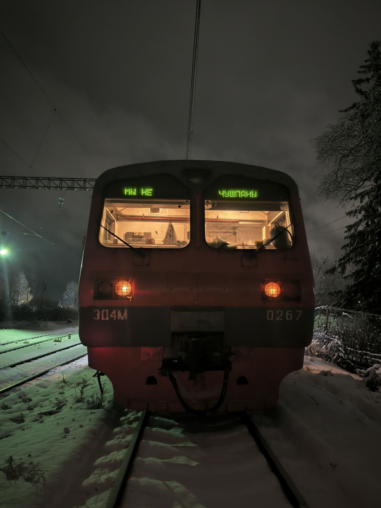
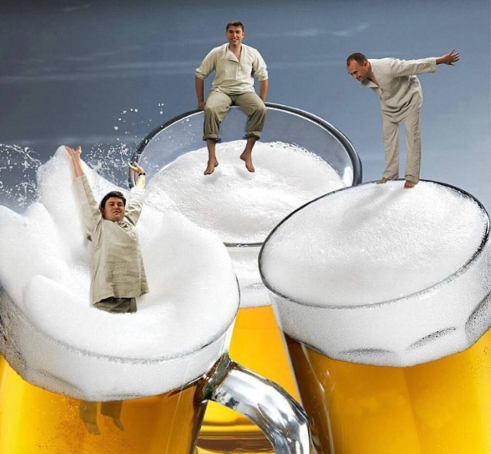

## Понедельник - день тяжёлый

  С субботы я гостил у родителей. Подключился на онлайн лекции, но вместо того, чтобы отправиться спать, как сделал бы каждый добропорядочный студент, проявил инициативу высшего уровня и презентовал доклад о процессах в операционных системах.

  Днём я возвращался в Москву. Больше пригородной электрички я ненавижу только 2 пригородные электрички. Запах фантомных фекалий, куда бы не сел, провинциалы, спорящие о том, какое пиво они откроют после следующей остановки, великое переселение зайцев в соседние вагоны, когда заходят кондукторы, агрессивные бабули, приватизировавшие 2 ряда и восхваляющие авторитарный режим, установившийся в стране (во времена Сталина, конечно). Чтобы как-то вынести подобные проявления вышеупомянутой массы, я надеваю наушники и это спасает... Но не надолго: через каждые 2 станции в начале вагона начинают появляться уездные коммерасанты с громкоговорителями, от которых, барабанные перепонки лопаются как воздушные шарики, запущенные у Кремля, а уши скручиваются в трубочку. Кажется, у них есть всё: дождевик, полотенце, плавки, сварочный аппарат, мороженое, наушники, пистолет Макарова и средства контрацепции (я думаю, самое нужное для вагонного контингента) - как говорится, всё: от батона до гондона, и всё это по сто рублей. По-моему, единственное, чего у них нет, - это ещё одного торгаша.
  
  Вытерпев час в электричке и полчаса в автобусе, я оказываюсь дома, где перевожу дух и сажусь за домашние задания.
  

  
## Вторник и Среда - дни тяжёлые

  Накануне вечером решив, что надо что-то менять в жизни, я встал в 6 утра, поспав рекордные за последнюю неделю 5 часов. С закрытыми глазами сделал кофе и лабу. Съездил на волейбол и вечером встретился с братом по ремеслу - другом-~~мазохистом~~ программистом. Ночь напролет мы писали на java. После 1.5-часового сна приехал в университет, где умирал 2 пары подряд. Не выдержав, уехал домой отсыпаться, но поскольку дел много, а в сутках всего 24 часа (какой гений это придумал!?), дневной сон составил пару часов, после чего я делал дз.
  

  
## Четверг - тоже день тяжёлый

  Съездил на пары, после которых преподавал математику своему ученику-садисту. Коротко о нём: тварь эта не обделена чувством юмора, а потому все 2 часа я был вскипающим чайником с красными глазами (от недосыпа!). Да-да, приходилось редактировать все задачки, в которых ответ хотя бы косвенно напоминал число 300. Вы себе просто не представляете, какой неописуемый восторг испытывало это прекрасное создание каждый раз, когда напоминало мне, что за убийство дают от 8 до 20 лет, ибо это единственное, что заставляло меня усидеть на месте после идиотских тезисов типа '2^{0,5} = 1', "детей бить нельзя" и тому подобных. 

  Героически пройдя через вышеперечисленные испытания, я измотанный лёг спать.
  

## Пятница - вот и дожили

  Безмерно счастливый, так как осознаю, что рабочая неделя закончилась и начались рабочие выходные. 
  

## Выводы

  Каюсь, грешен. Мог бы сделать гораздо больше, если бы грамотно распланировал своё время и восстановил режим. Но чтобы это сделать, надо сделать все лабы, а чтобы успеть сделать все лабы, надо найти на них время, а чтобы найти на них время, надо сделать все лабы, а чтобы сделать все лабы, надо...
  
  Всем мира и добра!
